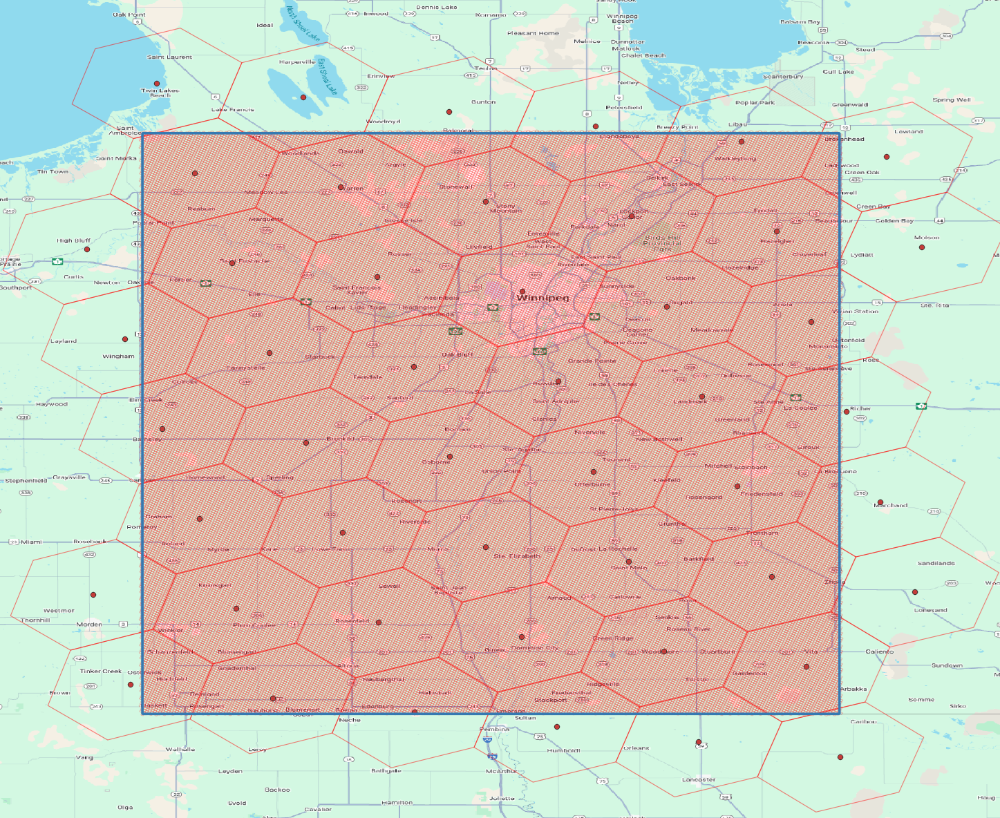

# OGC11 DGGS - Discrete Global Grid System

General scripts and documentation of data preparation for DGGS representation.

## References

- https://github.com/sahrk/DGGRID
- https://dggrid.readthedocs.io/latest/index.html

## Installation

The [DGGRID](https://github.com/sahrk/DGGRID) software must be compiled to run the examples.
When compiling it, it must be configured with GDAL support.

To make this process simple, it can be performed using `conda` or `mamba`, as shown below.
This ensures that binaries and libraries are correctly linked and aligned with the same C++ ABI.
However, you can also invoke the gcc/g++ compilers directly if you prefer with the relevant dependencies installed.

```shell
mamba create -n dggs -y python=3.12
mamba activate dggs
mamba install conda-forge::gcc conda-forge::gxx conda-forge::libgdal conda-forge::gdal cmake

git clone https://github.com/sahrk/DGGRID
mkdir -p DGGRID/build && cd DGGRID/build
cmake -DCMAKE_BUILD_TYPE=Release -DWITH_GDAL=ON ..
make -j $(nproc)
cp src/apps/dggrid/dggrid ${CONDA_PREFIX}/bin  # will be available from activated environment
```

## Execution

Ensure the `dggrid` executable can be found in the environment.
The following command should indicate whether the tool is found or not.
If not, you can enforce the path to the binary directly with `DGGRID_EXE` in your environment or `Makefile.config`.

```shell
make dggrid-info
```

Run the examples.
By default, this will combine any result that is missing outputs or when the corresponding `.meta` file changed.

```shell
make dggrid-run
```

To force execution, use:

```shell
make dggrid-run-force
```

## Examples

### Manitoba Study Area

ISEA43H DGGS at levels 9 and 16 overlapping the input polygon as sample area of interest.


