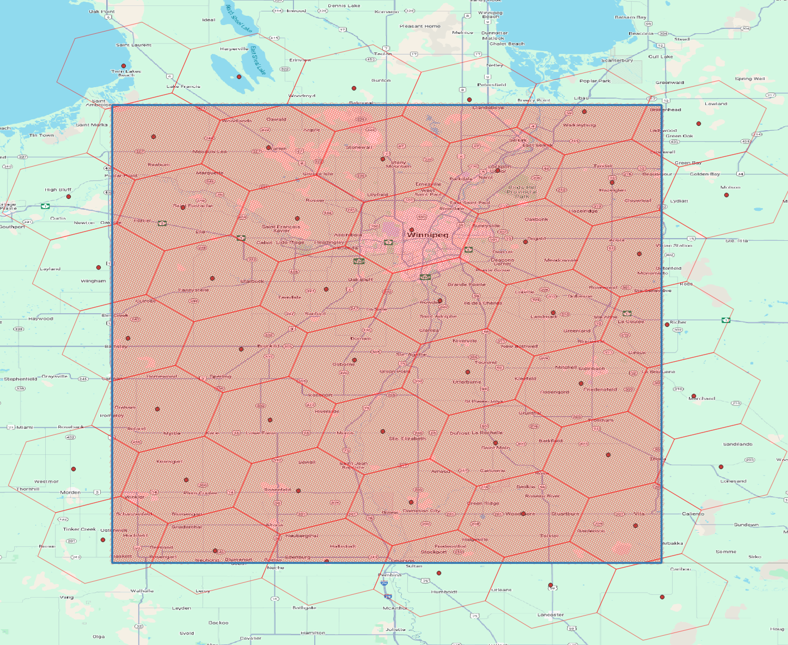
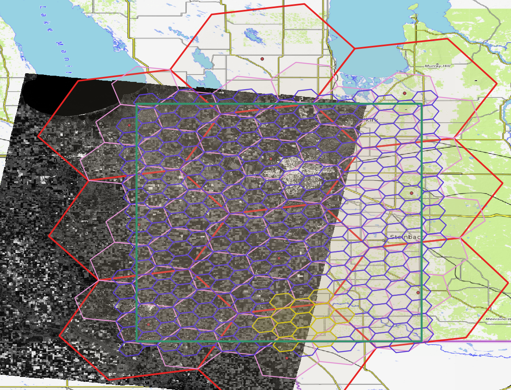
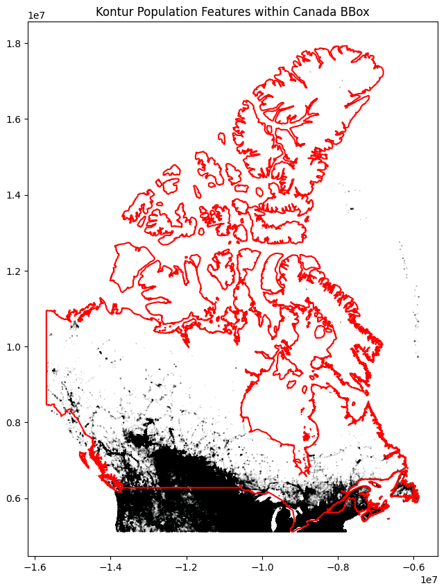
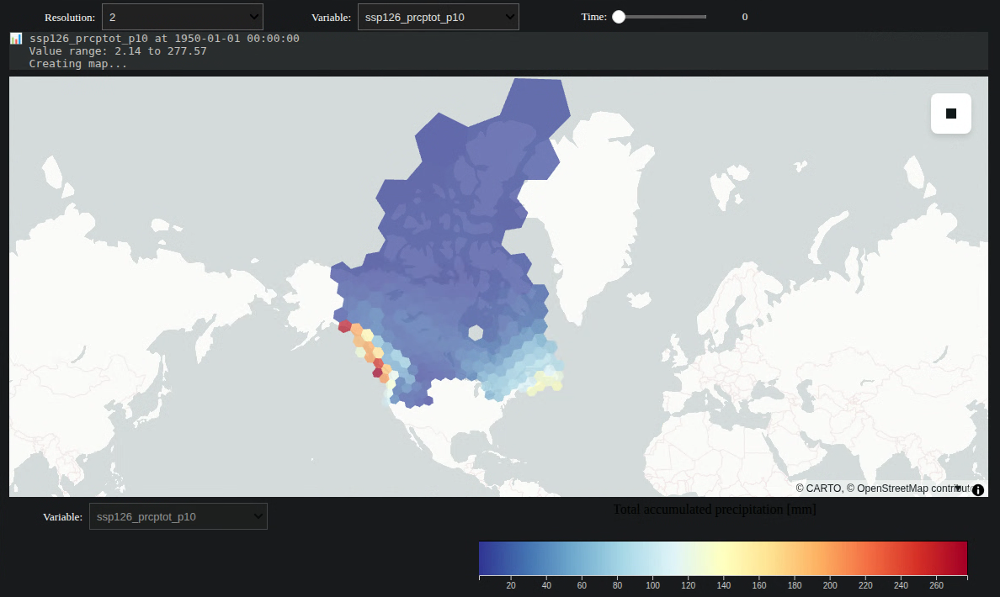
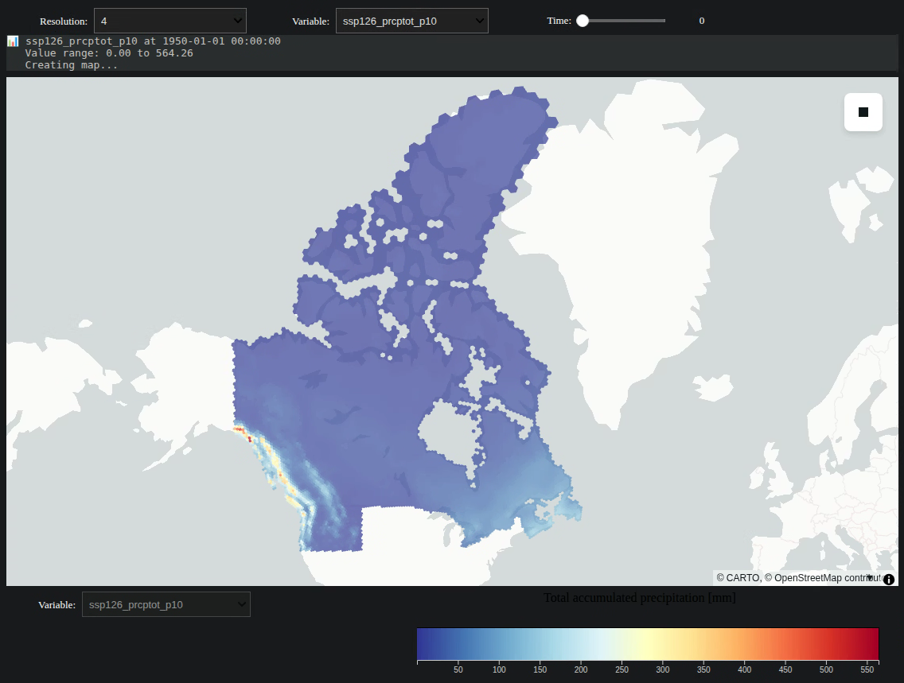
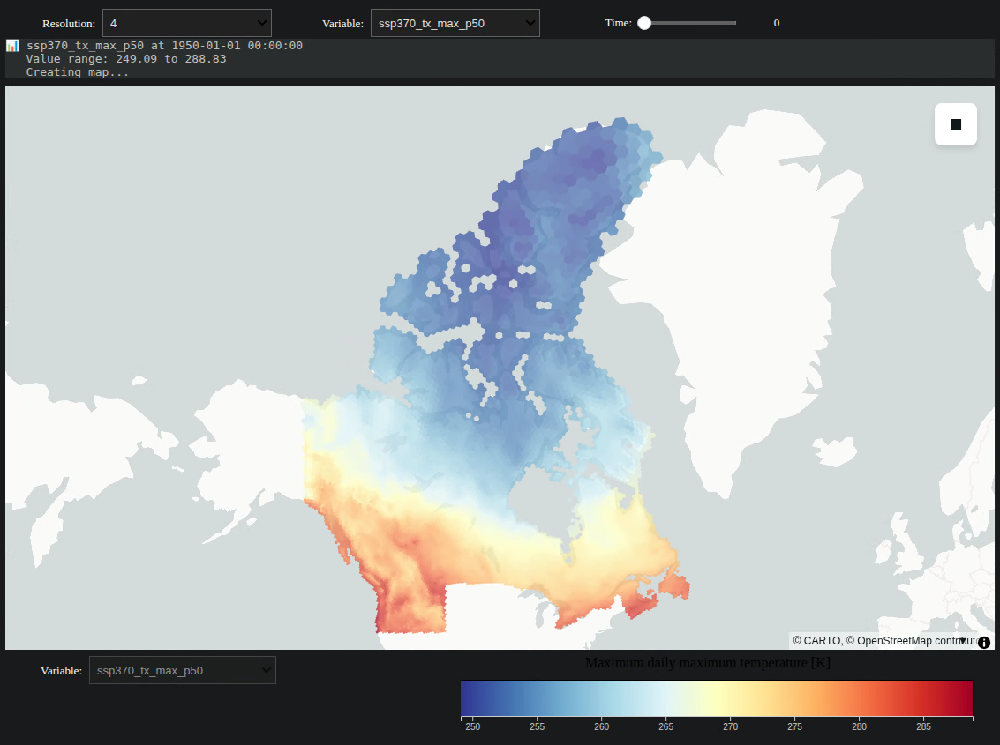
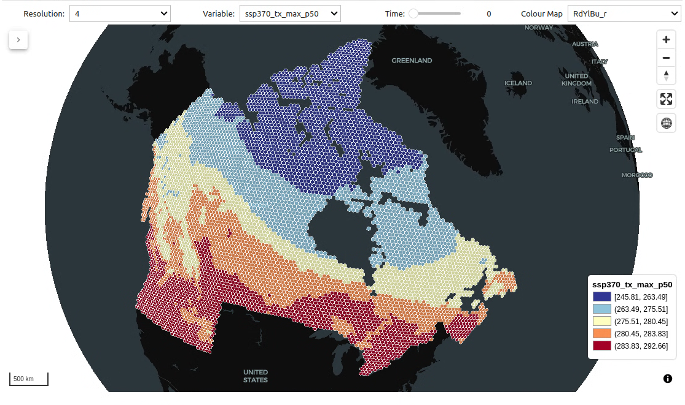

# OGC DGGS - Discrete Global Grid System

A collection of scripts, documentation, data preparation and visualization pipelines for DGGS representation.

This repository demonstrates multiple applications of DGGS data preparation pipelines using various data sources,
data domains, formats and encodings, DGGS types and librairies.

## Table of Contents

- [Analysis Examples](#analysis-examples)
  - [Manitoba-Winnipeg Study Area](#Manitoba-Winnipeg-Study-Area)
  - [Manitoba-Winnipeg DGGS Data Preparation from STAC RCM-ARD](#Manitoba-Winnipeg-DGGS-Data-Preparation-from-STAC-RCM-ARD)
  - [Canada Population H3 Data Preparation and Storage Analysis](#Canada-Population-H3-Data-Preparation-and-Storage-Analysis)
  - [Canada Climate Variables as DGGS H3  Zarr from NetCDF Lat/Lon/Time](#canada-climate-variables-as-dggs-h3--zarr-from-netcdf-latlontime)
  - [Parquet / DGGS-(UB)JSON Data Storage Analysis](Parquet--DGGS-UBJSON-Data-Storage-Analysis)
- [References](#references)
- [Important Notes](#important-notes)
- [Installation](#installation)
- [Execution](#execution)
- [Citation](#citation)
- [Acknowledgements](#acknowledgements)

## Analysis Examples

### Manitoba-Winnipeg Study Area

ISEA43H DGGS at levels 9 and 16 overlapping the input polygon as sample area of interest.




### Manitoba-Winnipeg DGGS Data Preparation from STAC RCM-ARD

Prepares IGEO7 / ISEA7H + 7Z (and optionally other DGGRS) from a STAC catalogue providing satellite imagery from
RCM-ARD (RADARSAT Constellation Mission Analysis-Ready Data).

See the Jupyter Notebooks under [manitoba-rcm-ard](manitoba-rcm-ard).




### Canada Population H3 Data Preparation and Storage Analysis

Using the [Kontur Population Dataset][kontur-population-dataset], prepares the H3 L0 to L8 zones filtered for Canada.

Additional analysis using GeoParquet format for efficient storage is evaluated for its compression
capacity using various representations of the columnar data and observing its impact on storage size.




### Canada Climate Variables as DGGS H3  Zarr from NetCDF Lat/Lon/Time

Collection of Jupyter notebooks that demonstrate loading, subsetting, visualizing,
and exploring climate datasets stored in Zarr format and projected into DGGS H3 representations.

The climate dataset is sourced from [ClimateData.ca](https://climatedata.ca/) and includes variables
such as temperature, precipitation, and other climate variables across Canada, for monthly time steps (years 1950-2100)
of historical and forecast, with multiple
[Social Economic Pathways](https://climatedata.ca/resource/understanding-shared-socio-economic-pathways-ssps/) (SSPs)
climate models and percentiles.

Spatial resolution of roughly 1/12° (lat/lon) and temporal resolution of 1 month are used as input from NetCDF files.
They are quantized into DGGS H3 representations at various resolutions (L0 to L6) for spatial analysis.
These DGGS encodings are converted to Zarr format with per-level groups and temporal chunks for efficient storage and access.

The notebooks show how to: prepare data, quantize into DGGS zones, visualize results on interactive maps.
Some libraries such as `xarray` and `xdggs` are employed optimize DGGS back-and-forth operations with Lat/Lon coordinates.

- `canada-climate/data_preparation.ipynb` —
  Data preparation pipeline: ingesting raw climate data, generating metadata scrapped from the source files
  and from [ClimateData.ca Variables](https://climatedata.ca/variables/), prepare DGGS Zarr results with chunking optimization,
  and output `pydggsapi` configurations for them.
- `canada-climate/dggs_visualize_zarr_data.ipynb` —
  Visualize DGGS climate variables from Zarr stores.
  Includes examples of generating 2D maps, a 3D globe rendering, and turning data into DGGS layers for interactive inspection.
- `canada-climate/dggs_subset_zarr_data.ipynb` —
  Tools and recipes to subset Zarr climate stores timeseries or variable subsets for DGGS zones across levels.
  Employed to publish a sample subset of the data as a public Zarr store.

Following are some sample visualization outputs produced with the notebooks.










### Parquet / DGGS-(UB)JSON Data Storage Analysis

The [parquet-dggs-ubjson-storage](./parquet-dggs-ubjson-storage/h3_parquet_dggs_json.ipynb) Notebook
provides an analysis of various storage formats for DGGS data, specifically comparing
Parquet and DGGS-(UB)JSON compressed formats for a relatively large dataset
(~33 million H3 L8 zones of the [Kontur Population Dataset][kontur-population-dataset]).


[kontur-population-dataset]: https://data.humdata.org/dataset/kontur-population-dataset

## References

**Summary of most relevant resources/libraries**: https://github.com/opengeoshub/vgrid#references

---

**Extra References**

- `dggrid` - Core library to many other DGGS handlers/manipulators
  - https://github.com/sahrk/DGGRID
  - https://dggrid.readthedocs.io/latest/index.html
- `dggrid4py` - Python wrapper of `dggrid` with high-level functions used by `pydggsapi` and data manipulation tools
  - https://github.com/allixender/dggrid4py
- `xdggs-dggrid4py`, `rhealpixdggs-py`, `xdggs` - Wrapper/Plugins for Python `xarray` and `dask`
  - https://github.com/LandscapeGeoinformatics/xdggs-dggrid4py
  - https://github.com/manaakiwhenua/rhealpixdggs-py
  - https://github.com/xarray-contrib/xdggs
  - https://xdggs.readthedocs.io/
- `vgrid` - Main generator/converter of most DGGRS types and CLI tools for raster/vector data to DGGS slicing
  - https://github.com/opengeoshub/vgrid
  - https://vgrid.gishub.vn/
- `vgridpandas` - GeoPandas integration including `s2pandas`, `h3pandas`, etc. for filtering DGGS data
  - https://vgridpandas.gishub.vn/
- `raster2dggs` - Partial alternative to `vgrid` but limited to raster and only DGGRS: H3, rHEALPix, S2
  - https://github.com/manaakiwhenua/raster2dggs

## Important Notes

- `ISEA`: Icosahedral Snyder Equal Area
- `IGEO7`: this DGGRS is sometimes mentioned in libraries, but not mentioned across all implementations explicitly.
  However, `IGEO7` is simply an alias to `ISEA7H + 7Z`, ie: Hexagonal equal-area ISEA orientation with aperture 7
  specifically using the Z7 indexing system (hierarchical integer indexes using an  aperture 7
  Central Place Indexing Sahr) [https://agile-giss.copernicus.org/articles/6/32/2025/agile-giss-6-32-2025.pdf].
  Each hexagon "zoom-level" consists of 7 sub-hexagons of equal area.

## Installation

The [DGGRID](https://github.com/sahrk/DGGRID) software must be compiled to run the examples.
When compiling it, it must be configured with GDAL support.

To make this process simple, it can be performed using `conda` or `mamba`, as shown below.
This ensures that binaries and libraries are correctly linked and aligned with the same C++ ABI.
However, you can also invoke the gcc/g++ compilers directly if you prefer with the relevant dependencies installed.

```shell
mamba env create --file environment.yml
mamba activate ogc-dggs
```

```shell
git clone https://github.com/sahrk/DGGRID
mkdir -p DGGRID/build && cd DGGRID/build
cmake -DCMAKE_BUILD_TYPE=Release -DWITH_GDAL=ON ..
make -j $(nproc)
cp src/apps/dggrid/dggrid ${CONDA_PREFIX}/bin  # will be available from activated environment
```

## Execution

Ensure the `dggrid` executable can be found in the environment.
The following command should indicate whether the tool is found or not.
If not, you can enforce the path to the binary directly with `DGGRID_EXE` in your environment or `Makefile.config`.

```shell
make dggrid-info
```

Run the examples.
By default, this will combine any result that is missing outputs or when the corresponding `.meta` file changed.

```shell
make dggrid-run
```

To force execution, use:

```shell
make dggrid-run-force
```

## Citation


If this work is used in your research, please consider citing it according to the [CITATION.cff](CITATION.cff) file.

## Acknowledgements

This work has been financed by
the [OGC AI-DGGS for Disaster Management Pilot](https://www.ogc.org/initiatives/ai-dggs-pilot/)
driven by the [Open Geospatial Consortium](https://www.ogc.org/)
and sponsors composed of the [Centre national d’études spatiales](https://cnes.fr/) (CNES),
the [European Space Agency](https://www.esa.int/) (ESA),
[Natural Resources Canada](https://natural-resources.canada.ca/) (NRCan),
the [United States Geological Survey](https://www.usgs.gov/) (USGS),
and in-kind contributions from the [Computer Research Institue of Montréal](https://crim.ca/) (CRIM).
